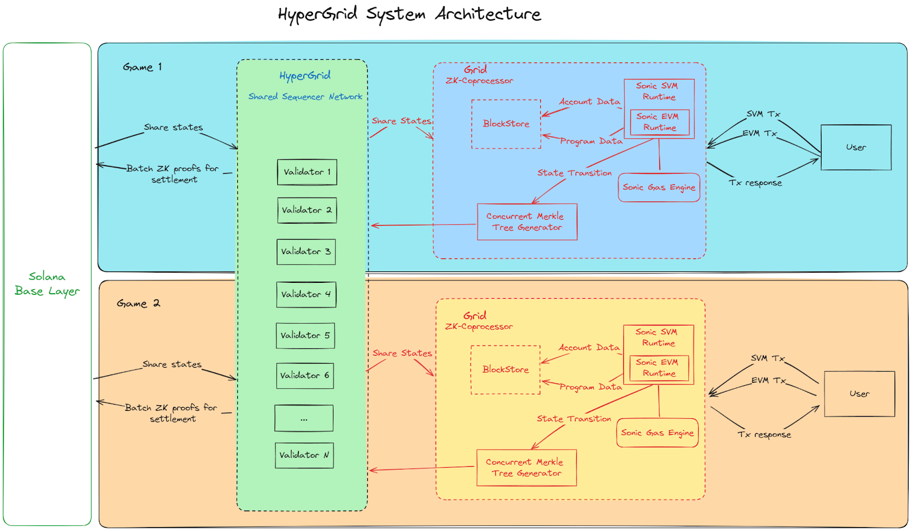

# Architectural Overview

HyperGrid's architecture is predicated on a multi-grid approach, wherein each grid operates semi-autonomously while remaining anchored to the Solana mainnet for consensus and finality. This section will dissect the structural elements and their interrelations.

<figure><figcaption>
HyperGrid System Architecture
</figcaption></figure>

### Key Components

1. **Solana Base Layer**: The foundation upon which the HyperGrid system is built, providing ultimate consensus and finality.
2. **HyperGrid Shared State Network (HSSN)**:
   * Central to the architecture, spanning across all grids
   * Contains multiple validators (Validator 1 through Validator N)
   * Facilitates sharing of states between Grids and the Solana Base Layer
   * Manages batch ZK proofs for settlement
3. **Grid Structure** (exemplified by Grid 1 and Grid 2):
   * Each grid represents a semi-autonomous ecosystem, potentially dedicated to specific applications (e.g., different games)
   * Components within each grid:
     * **ZK-Coprocessor**: Manages grid-specific operations merkle proof operations.
     * **SVM Runtime**: Execution environments for Grids on Solana Virtual Machine
     * **Sonic Gas Engine**: Manages computational resources
     * **Concurrent Merkle Tree Generator**: Efficiently processes state transitions
4. **User Interaction**:
   * Users can interact with each grid independently
   * Transactions (SVM Tx and EVM Tx) flow between users and the respective grid's runtimes
   * Transaction responses are sent back to users

### Data Flow

1. **Interoperability – State Sharing**:
   * Bi-directional state sharing occurs between the Solana Base Layer and the HSSN
   * HSSN shares states with individual grids
   * State sharing can also happen between Grids as we shall see later
2. **ZK Proofs**:
   * Transactions are compressed and aggregated into a Merkle tree.
   * For each block, we shall commit the corresponding root state hash.
   * The Validity Proof for this block is computed on Grid.
   * ZK proofs for settlement are posted from the HSSN to the Solana Base Layer.

This architecture enables HyperGrid to achieve high scalability and flexibility while maintaining a strong connection to the security and finality provided by the Solana blockchain.
