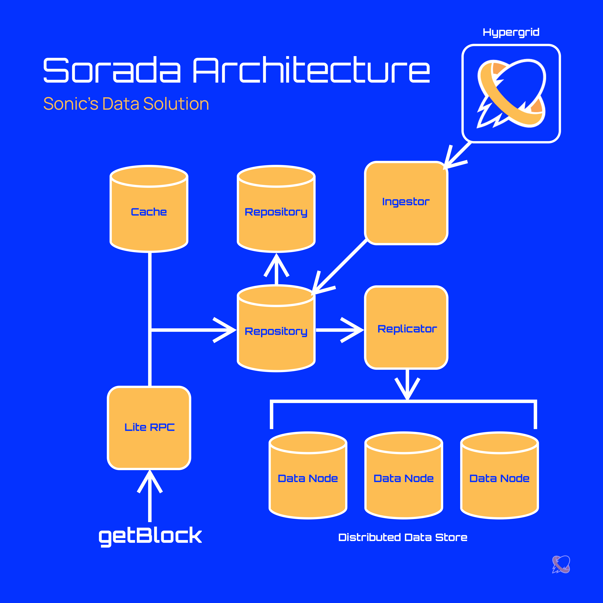
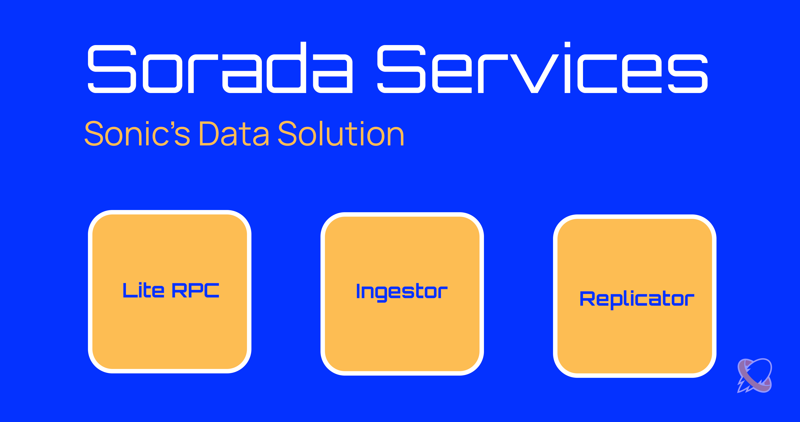
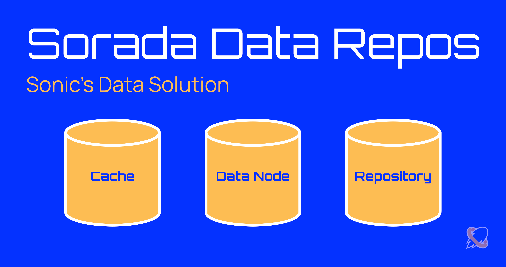

# Architecture

<figure><figcaption>
Sorada Architecture Diagram
</figcaption></figure>

## Services

Sorada is composed of multiple services that enable Sonic to optimize read requests

<figure><figcaption>
Sorada Services
</figcaption></figure>

### Lite RPC

The Lite RPC service is an optimized Solana RPC service stripped away from a Solana full node only maintaining data retrieval endpoints such as `getBlock` and `getTransaction`.

### Ingestor

The Ingestor service pulls real-time data from the Sonic Hypergrid and persists data on the big table storage.

### Replicator

The Replicator service replicates the indexed data from the big table storage to a distributed filesystem for more resilient data preservation.

## Data Repositories

Sorada utilizes three (3) different data repository types for a robust data preservation infrastructure.

<figure><figcaption>
Sorada Data Repositories
</figcaption></figure>

### Cache

Sorada utilizes a cache for an efficient retrieval of repetitive requests.

### Big Table

Sorada utilizes a big table database as its primary data store.

### Distributed Filesystem

Sorada utilizes a self-replicating distributed filesystem to ensure data is safely persisted across multiple data nodes.
