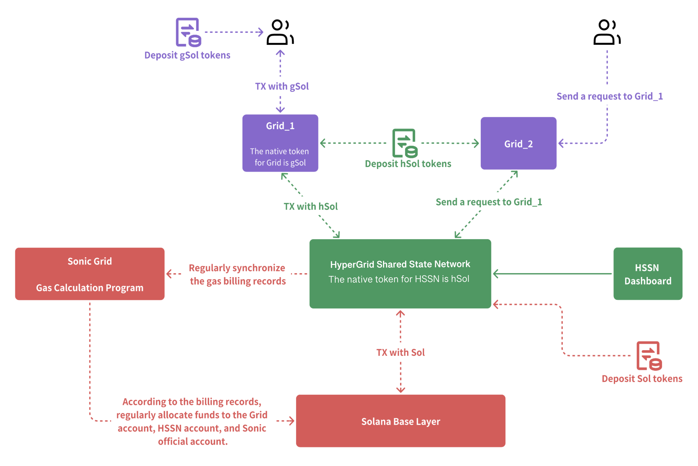

# HSSN Gas Fee Mechanism

## Overview

In the HSSN architecture, gas fees for user-initiated transactions are distributed into four parts. It's important to note that gas fee distributions can vary between transactions. Below is a sample transaction to illustrate how fees are distributed:

### Sample Transaction

| Recipient  | Amount (SOL) | Percentage |
| ---------- | ------------ | ---------- |
| Burned     | 0.00000125   | 50%        |
| HSSN Fees  | 0.00000313   | 12.52%     |
| SONIC Fees | 0.00000313   | 12.52%     |
| GRID Fees  | 0.00000625   | 25%        |
| Total Fee  | 0.00000250   | 100%       |

This transaction can be viewed on the [Sonic Explorer](https://explorer.sonic.game/tx/5r5tiPMrktPnroaNuexYvHS57ujRmuPEtU6Yr4d3WUK5FuyerBRe4Gi2TYAYaKd3QhhNNgaAZoA5j2h4wepZueTv).

#### Distribution Explanation:

1. **Burned Fees**: A portion of the gas fee is burned, effectively removing it from circulation. This can help control token supply and potentially increase the value of remaining tokens.
2. **HSSN Fees**: This portion goes to the Hypergrid Shared State Network validators for their role in managing and transmitting transaction information.
3. **SONIC Fees**: This is allocated to the Sonic Grid, which is responsible for packaging and executing bills.
4. **GRID Fees**: This portion is allocated to the Grid nodes that initially receive and process user transaction requests.

It's crucial for users to understand that this is just an example, and actual gas fees and their distribution may vary in live transactions. Factors such as network congestion, transaction complexity, and current gas prices can influence both the total fee and how it's distributed.

Always refer to the most current information provided by the network for accurate gas fee estimates and distributions.

<figure><figcaption></figcaption></figure>

## Gas Fee Distribution Process

### 1. Transaction Request and Bill Generation

When a Grid node receives a user's transaction request:

* It calculates the required gas fee
* Distributes this fee among participating nodes based on predefined rules
* Generates a detailed bill record

### 2. Bill Forwarding and Viewing

* Grid nodes run the `hypergrid-aide` program
* This program periodically forwards gas fee bills to HSSN validators
* Users can view transaction order details on the [HSSN Dashboard](https://explorer-hssn.hypergrid.dev/fee) under the "Grid Block Fee" tab

<figure><figcaption></figcaption></figure>

### 3. Execution and Viewing of Bills by Sonic Grid

* Sonic Grid, a special service node, packages forwarded bills
* It periodically executes these bills in batches
* Users can view packaged and executed bill details on the [HSSN Dashboard](https://explorer-hssn.hypergrid.dev/fee) under the "Fee Settlement" tab

<figure><figcaption></figcaption></figure>

### 4. Final Gas Fee Distribution

When Sonic Grid executes bill distribution:

* It transfers corresponding gas fees to participating nodes' wallets
* This includes Grid nodes, HSSN validator nodes, Sonic Grid official nodes, and Solana base layer nodes
* The distribution is based on the pre-calculated plan

## Transparency and Efficiency

This process ensures:

* Efficient gas fee distribution
* Transparency in transactions
* Easy access to bill information for users via the HSSN Dashboard

## Relationship to Other Components

The HSSN gas fee system is integral to the overall Grid ecosystem:

* It interacts closely with individual Grids for initial fee calculation
* Utilizes the HSSN for bill forwarding and validation
* Involves the Solana Base Layer in the final distribution
* Leverages the HSSN Dashboard for transparency and user access to fee information

By providing a clear and fair gas fee distribution mechanism, this system contributes to the overall efficiency and sustainability of the Grid ecosystem.
